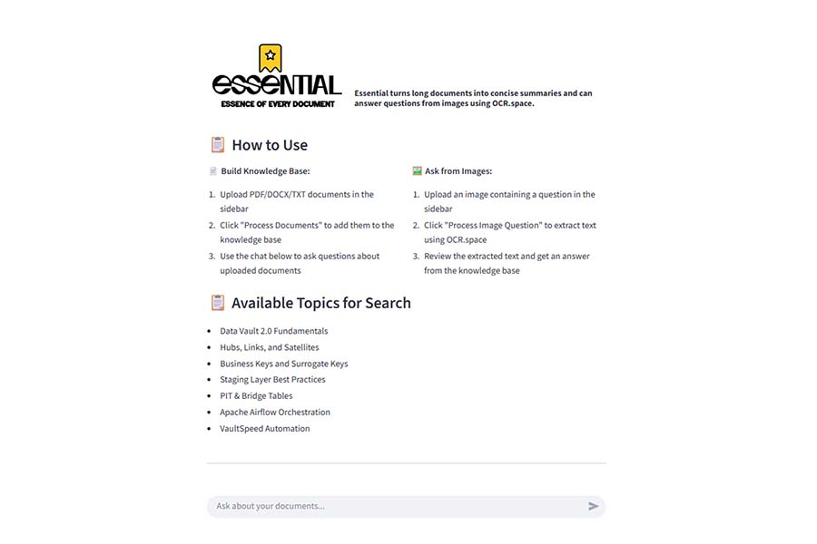

````markdown
# 🧠 Essential — Essence of Every Document

**Essential** turns long documents into concise summaries and can also answer questions from images using OCR technology.  
It’s designed to help you quickly extract key insights from PDFs, DOCX, TXT files, and even image-based content.

---

## 🚀 Features

- 📄 **Document Summarization:** Upload PDF, DOCX, or TXT files and get concise summaries.  
- 🧠 **Knowledge Base:** Build a searchable repository of processed documents.  
- 🖼️ **Image Question Answering:** Upload an image with text and get answers using OCR (via [OCR.space](https://ocr.space/)).  
- 🔍 **Smart Search:** Ask questions about uploaded content and get instant, context-aware answers.

---

## 🧩 How to Use

### 📘 Build Knowledge Base
1. Upload **PDF/DOCX/TXT** documents in the sidebar.  
2. Click **“Process Documents”** to add them to your knowledge base.  
3. Use the chat input to ask questions about the uploaded documents.

### 🖼️ Ask from Images
1. Upload an image containing a **question** in the sidebar.  
2. Click **“Process Image Question”** to extract text using OCR.space.  
3. Review the extracted text and get an answer from the knowledge base.

---

## 🔎 Available Topics for Search

- Data Vault 2.0 Fundamentals  
- Hubs, Links, and Satellites  
- Business Keys and Surrogate Keys  
- Staging Layer Best Practices  
- PIT & Bridge Tables  
- Apache Airflow Orchestration  
- VaultSpeed Automation  

---

## 🧰 Tech Stack

- **Frontend:** Streamlit  
- **Backend:** Python  
- **OCR Engine:** OCR.space API  
- **Vector Database:** (Optional) ChromaDB or FAISS for semantic search  

---

## 🛠️ Setup Instructions

1. Clone this repository:
   ```bash
   git clone https://github.com/yourusername/essential.git
   cd essential
````

2. Install dependencies:

   ```bash
   pip install -r requirements.txt
   ```
3. Create a `.env` file and add your OCR.space API key:

   ```
   OCR_API_KEY=your_api_key_here
   ```
4. Run the app:

   ```bash
   streamlit run app.py
   ```

---

## 📸 Screenshot



---

## 📄 License

This project is licensed under the [MIT License](LICENSE).

---

## 💬 Author

Built by **Venkata Sriharsha Siddam**
🌐 [GitHub Portfolio](https://sriharsha557.github.io/myapps/)

```

---

Would you like me to adjust it for **GitHub Pages** style (for example, with emoji headers and centered title/logo) or keep it plain and developer-focused?
```
